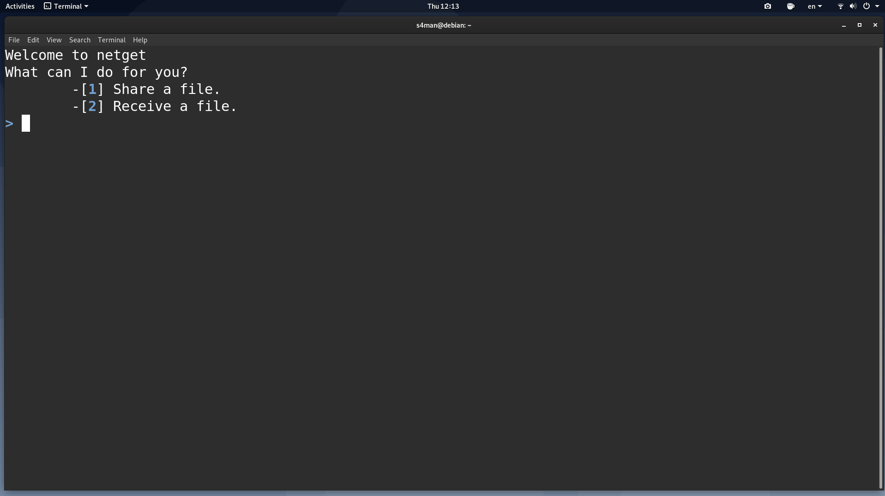
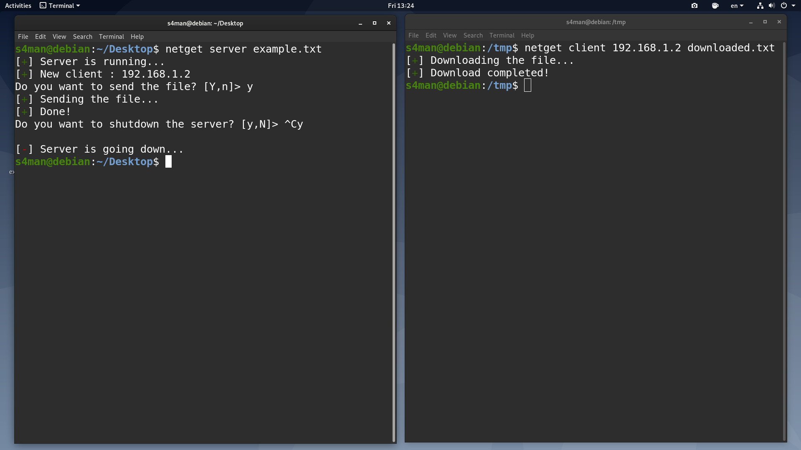

# netget


A python script for transferring files easily between the Unix-based systems. (PORT => 7575 (TCP))

[](https://www.python.org/)
[](https://www.gnu.org/licenses/gpl-3.0)

### Installation

Shell:

```shell
(NETGET_DIRECTORY)$ ./install.sh
```

### Usage

CLI:

```shell
$ netget
```

Server:

```shell
$ netget server FILENAME
```

Client:

```shell
$ netget client SERVER_IP_ADDRESS FILENAME
```

### Screenshots





### Other

GNU General Public License (GPL) v3.0 .

